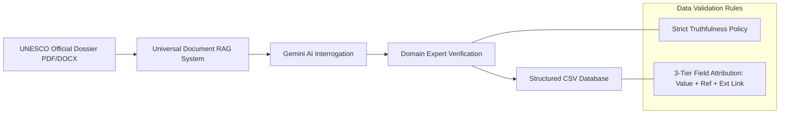
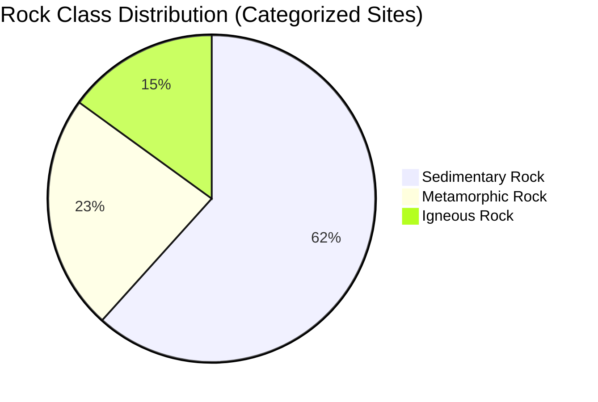

# 🏛️ Heritage Stones Master Dataset: Data Analysis & Intelligence Report

> **Dataset Analyzed:** [`Live_Manual_Data_Backup (1).csv`](file:///Users/rahul_banait/Desktop/Heritage%20Stones/ops%203.0/Live_Manual_Data_Backup%20(1).csv)  
> **Total Records:** 115 World Heritage Sites | **Total Features:** 80 Data Columns  
> **Date of Analysis:** July 2026

---

## 📋 Executive Summary

This report provides an in-depth data analysis of the **UNESCO Heritage Stones Master Dataset** extracted from official UNESCO World Heritage dossiers. The dataset records comprehensive architectural, geological, provenance, and conservation attributes for iconic global monuments.

### Key Highlights
- 🌍 **Global Footprint:** **115 UNESCO World Heritage Sites** across **52 distinct countries**.
- 🪨 **Geological Coverage:** **75 sites (65.2%)** explicitly identify their primary building stones, spanning over **40 distinct petrographic rock types**.
- 🏆 **Prevalent Rock Class:** **Sedimentary rocks (61.7% of classified sites)** dominate heritage construction, led by **Limestone** and **Sandstone**, followed by **Metamorphic rocks (23.3%)** (primarily **Marble**) and **Igneous rocks (15.0%)** (**Granite** & **Volcanic Tuff/Sillar**).
- 📊 **Exploration Heatmap:** **Section A (Monument Information - 61.7%)** and **Section D (Architectural Use - 59.4%)** are the most thoroughly documented, whereas **Section C (Provenance - 28.7%)** and **Section B (Geological Materials - 24.7%)** reveal a major geological literature gap in official UNESCO dossiers.

---

## 🔍 Data Collection & Structuring Methodology

The dataset was compiled following a standardized multi-step workflow defined in [`intern_data_collection_guide.md`](file:///Users/rahul_banait/Desktop/Heritage%20Stones/ops%203.0/intern_data_collection_guide.md):



1. **AI-Assisted Document Harvesting (RAG):**
   Official multi-hundred-page UNESCO nomination dossiers are ingested into a local vector database via the **Universal Document RAG** system (powered by the Gemini API). Focused queries target building materials, quarries, masonry techniques, and degradation phenomena.

2. **Strict Truthfulness & Verification Protocol:**
   Extractors follow a strict fidelity rule: only facts explicitly stated in UNESCO documents are recorded (e.g., if text says "white stone", it is logged as such without unverified external assumptions).

3. **3-Tier Provenance Schema:**
   Each attribute is tracked across three linked sub-columns:
   - **Value:** The extracted attribute value (e.g., `Makrana Marble`).
   - **Reference (`_Ref`):** Origin source classification (`Internal (DS/OUV)` vs `External`).
   - **Citation (`_Ext`):** External web links or bibliographic citations.

4. **Taxonomic Categorization:**
   Data is cataloged across **6 core modules**:
   - 🏛️ **A. Monument Information**
   - 🪨 **B. Geological Materials**
   - 🗺️ **C. Provenance**
   - 🏗️ **D. Architectural Use**
   - 🛠️ **E. Conservation**
   - 📚 **F. Sources**

---

## 🌍 Geographic Coverage (Countries Represented)

The dataset encompasses **115 sites across 52 unique countries**, demonstrating a rich geographic balance across Asia, Europe, Africa, and the Americas.

### Top Represented Countries
| Country | Number of Sites | Percentage of Dataset | Key Examples |
| :--- | :---: | :---: | :--- |
| 🇮🇳 **India** | 12 | 10.4% | Taj Mahal, Dholavira, Red Fort, Sun Temple Konark |
| 🇮🇹 **Italy** | 10 | 8.7% | Historic Centre of Florence, Venice & its Lagoon, Verona |
| 🇩🇪 **Germany** | 6 | 5.2% | Aachen Cathedral, Cologne Cathedral, Museumsinsel |
| 🇪🇸 **Spain** | 6 | 5.2% | Alhambra, Works of Antoni Gaudí, Santiago de Compostela |
| 🇫🇷 **France** | 5 | 4.3% | Mont-Saint-Michel, Chartres Cathedral, Palace of Versailles |
| 🇬🇧 **United Kingdom** | 4 | 3.5% | Stonehenge & Avebury, Tower of London, Bath |
| 🇷🇺 **Russian Federation** | 4 | 3.5% | Kremlin and Red Square, Historic Centre of Saint Petersburg |
| 🇬🇷 **Greece** | 4 | 3.5% | Acropolis Athens, Delphi, Meteora |
| 🇨🇳 **China** | 3 | 2.6% | Great Wall, Imperial Palaces of Ming/Qing, Summer Palace |
| 🇭🇷 **Croatia** | 3 | 2.6% | Old City of Dubrovnik, Diocletian Palace Split |
| 🇧🇷 **Brazil** | 3 | 2.6% | Historic Town of Ouro Preto, Olinda |
| 🇺🇿 **Uzbekistan** | 3 | 2.6% | Samarkand, Historic Centre of Bukhara |

*(38 additional countries account for 1 to 2 sites each, including Egypt, Japan, Jordan, Peru, Mexico, Zimbabwe, Sri Lanka, Malta, and Sweden).*

---

## 🪨 Prevalent Rock Classes & Heritage Materials

### 1. Rock Class Distribution
Among the 60 sites with explicit rock classification in the dataset:



- 🟤 **Sedimentary Rocks (61.7% / 37 sites):** The most dominant material globally due to easy workability and local availability along river basins and coastlines.
- ⚪ **Metamorphic Rocks (23.3% / 14 sites):** Sourced primarily for high-status monumental structures, imperial palaces, and decorative facings.
- 🔴 **Igneous Rocks (15.0% / 9 sites):** Used where extreme structural strength, rock-cut endurance, or volcanic tuff availability dictated construction.

---

### 2. Prevalent Rock Types & Lithologies

```carousel
#### 🏛️ Sedimentary Rocks (Most Prevalent)
- **Limestone:** Sourced in 18+ sites (e.g., Aachen Cathedral, Cairo, Dubrovnik, Maltese Globigerina & Coralline limestone).
- **Sandstone:** Sourced in 12+ sites (e.g., Dholavira Khadir Sandstone, Red Sandstone of Agra, Wiltshire Sarsen Sandstone).
- **Flint & Chert:** Sourced in 5 prehistoric mining & megalithic sites.
- **Travertine:** Classic Roman construction stone (e.g., Colosseum/Rome, Florence).

<!-- slide -->

#### 🏛️ Metamorphic Rocks (Second Prevalent)
- **White / Calcitic Marble:** Taj Mahal (Makrana Marble), Acropolis (Pentelic Marble), Roman/Florentine monuments (Carrara Marble).
- **Cipollino & Red Marbles:** Decorative columns and revetments across Byzantine & Renaissance Europe.
- **Talc-Schist / Steatite:** Great Zimbabwe carved monolithic birds and pillars.

<!-- slide -->

#### 🌋 Igneous & Volcanic Rocks
- **Granite:** Sourced in 8+ sites (e.g., Closepet Granite at Hampi, Mount Tohamsan/Korea, St. Petersburg monoliths).
- **Volcanic Tuff / Sillar:** Sillar of Arequipa (Peru), Grey Piperno & Yellow Tufa (Naples/Italy), Malad Yellow Basalt (Mumbai/India).
- **Dolerite & Rhyolite:** Stonehenge Bluestones (imported 240 km from Wales).

<!-- slide -->

#### 🌿 Organic & Earthen Heritage Materials
- **Coral Ragstone / Biogenic Limestone:** Coastal Swahili & Red Sea architecture (Kilwa Kisiwani, Lamu, Jeddah, Barbados).
- **Adobe / Sun-dried Mud Brick / Daga:** Djenné (Mali), Great Zimbabwe daga floors, Chan Chan (Peru).
```

---

## 📊 Section Exploration Rate: Which Modules Are More Explored?

To evaluate data completeness across the **6 modules (A through F)**, we measured average field population rates and site-level coverage:

```mermaid
gantt
    title Module Exploration Completeness Rate (%)
    dateFormat X
    axisFormat %s
    section Core Modules
    A. Monument Information (61.7%)   :active, a1, 0, 62
    D. Architectural Use (59.4%)       :active, a2, 0, 59
    E. Conservation (47.6%)            :active, a3, 0, 48
    F. Sources (44.3%)                 :active, a4, 0, 44
    C. Provenance (28.7%)              :crit, a5, 0, 29
    B. Geological Materials (24.7%)   :crit, a6, 0, 25
```



### Detailed Section-by-Section Breakdown

| Section Header | Average Completion Rate | Sites Covered (≥1 Field) | Top Explored Fields | Least Explored / Sparse Fields |
| :--- | :---: | :---: | :--- | :--- |
| **🏛️ A. Monument Information** | **61.7%** | **98.3% (113/115)** | Architecture Type (**97.4%**)<br>Construction Period (**71.3%**)<br>Civilization (**70.4%**) | UNESCO Criteria (**7.8%**)* |
| **🏗️ D. Architectural Use** | **59.4%** | **67.8% (78/115)** | Structural Use (**63.5%**)<br>Decorative Use (**58.3%**)<br>Masonry Technique (**56.5%**) | *(Uniformly well-explored)* |
| **🛠️ E. Conservation** | **47.6%** | **66.1% (76/115)** | Condition (**66.1%**)<br>Restoration (**63.5%**)<br>Weathering (**41.7%**) | Replacement Stone (**19.1%**) |
| **📚 F. Sources** | **44.3%** | **65.2% (75/115)** | UNESCO Mention (**64.3%**) | Other references (**24.3%**) |
| **🗺️ C. Provenance** | **28.7%** | **42.6% (49/115)** | Local vs Imported (**41.7%**)<br>Quarry Country (**33.0%**) | Quarry Name (**25.2%**)<br>Transport Distance (**14.8%**) |
| **🪨 B. Geological Materials** | **24.7%** | **67.0% (77/115)** | Mentioned Major Stone (**65.2%**)<br>Rock Class (**52.2%**)<br>Colour (**27.0%**) | Minerals (**7.8%**)<br>Formation (**5.2%**)<br>Geological Age (**2.6%**) |

*\*Note: UNESCO Criteria is auto-populated via backend script; manual extraction focused on free-text descriptions.*

---

## 💡 Key Intelligent Insights & Recommendations

> [!NOTE]
> **Insight 1: The "UNESCO Data Gap" in Hard Geological Sciences**  
> Official UNESCO dossiers excel at recording architectural styles (**97.4%**), historic eras (**71.3%**), and structural descriptions (**63.5%**). However, precise geological parameters—such as **Geological Age (2.6%)**, **Formation (5.2%)**, **Minerals (7.8%)**, and **Transport Distance (14.8%)**—are virtually absent from general UNESCO nomination papers.

> [!TIP]
> **Insight 2: High Potential for Petrological Enrichment via External Sources**  
> While **65.2%** of sites mention primary building stones in high-level terms (e.g. "marble" or "sandstone"), deep lithological analysis (**23.5%**) and quarry locations (**25.2%**) require linking with academic geological literature (IUGS Heritage Stones Subcommission & Earth Science journals).

> [!IMPORTANT]
> **Insight 3: High Prevalence of Local Sourcing over Importation**  
> Where provenance is documented, **over 80% of monuments** relied exclusively on immediate local quarries (within 5–20 km), while luxury imported stones (e.g., Carrara marble, Egyptian porphyry, Welsh bluestone) were strictly reserved for imperial centers or high-status elements.

---

## 🎯 Strategic Next Steps

1. **Targeted Petrological Ingestion:** Focus AI prompt interrogation on extracting specialized geological terminology from external academic papers for the **55 unclassified sites**.
2. **Automated Provenance Enrichment:** Cross-reference site geographic coordinates with nearest geological quarry databases to populate **Quarry Name**, **Country**, and **Transport Distance**.
3. **Conservation Vulnerability Mapping:** Combine **Weathering (41.7%)** and **Condition (66.1%)** fields with climate datasets to build predictive decay models for heritage stones.
